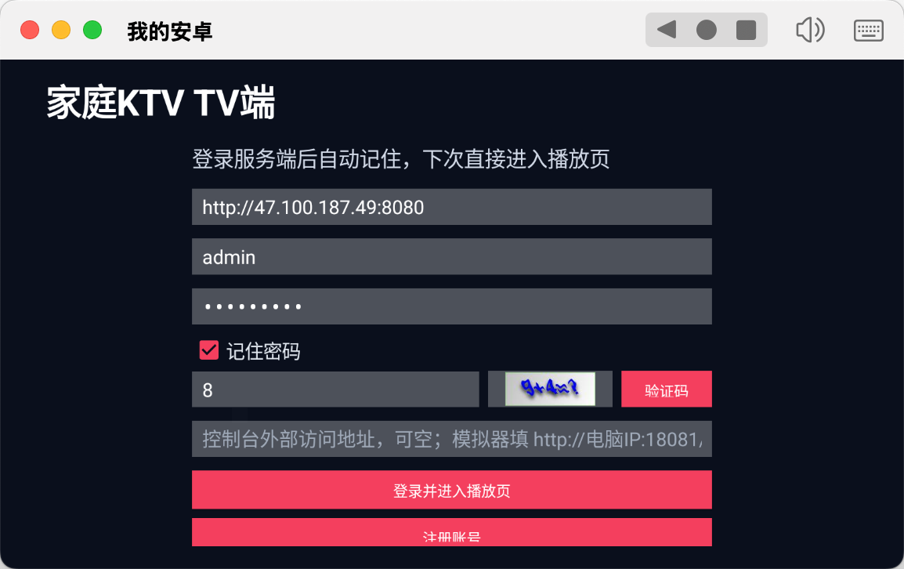
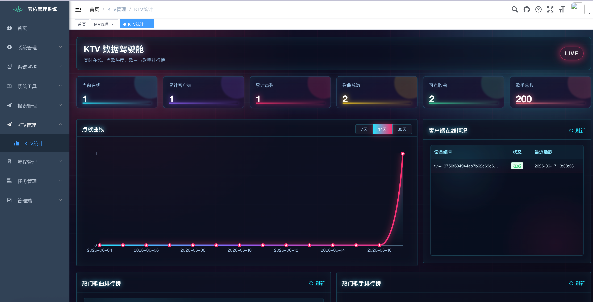
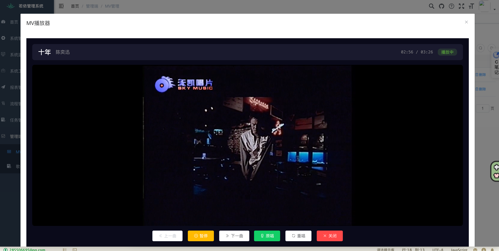
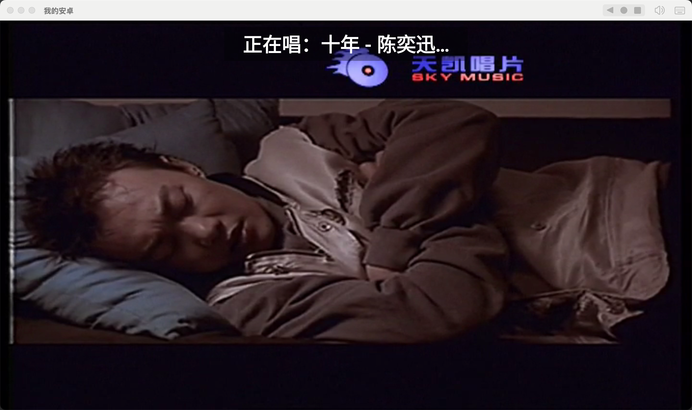
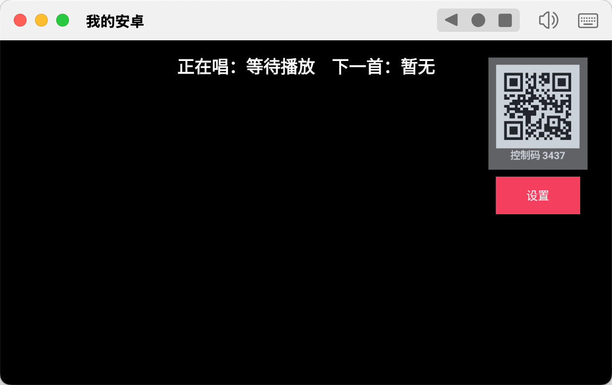
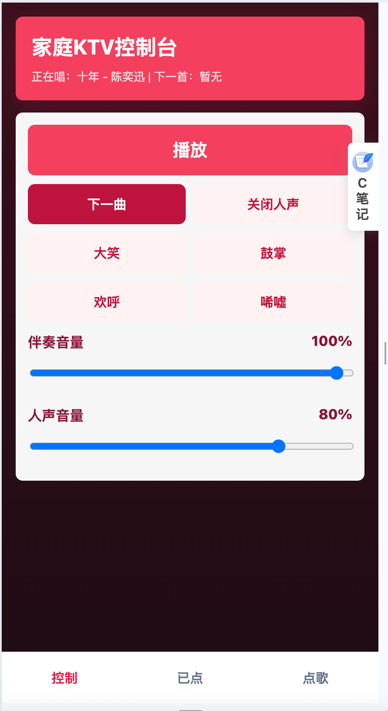

# RuoYi Karaoke

基于 RuoYi-Vue 3.8.7 二次开发的家庭 KTV 管理系统。项目提供后台管理、MV 批量上传与解析、歌手管理、点歌队列、客户端在线统计、热门排行、ONNX 人声/伴奏分离，以及面向电视播放端和手机控制端的接口能力。

> 本项目只面向家庭自用、学习和技术研究。请仅上传、采集、处理你拥有版权、授权或明确允许使用的音视频资源。

## 功能特性

- MV 管理：单个/批量上传、编辑歌名和歌手、播放预览、删除、处理状态查看。
- 批量解析：选定 MV 后加入后台解析队列，支持二次解析和重新解析。
- 歌手管理：歌手名称、地区、性别、排序、状态、拼音首字母等信息维护。
- 音视频处理：提取音频、生成无声 MV、拆分伴奏和人声、输出 Android 友好的音频资源。
- 分离策略：支持 ONNX 模型分离、DSP 中置声道近似处理，以及 ONNX 失败回退 DSP 的 `auto` 模式。
- 点歌接口：搜索歌曲、分类查询、加入已点、置顶、删除、切歌、查询队列。
- 多客户端隔离：通过 `deviceId` 区分不同电视端，避免多个设备之间队列互相影响。
- 数据统计：客户端在线数、在线详情、累计点歌数、点歌曲线、热门歌曲排行、热门歌手排行。
- WebSocket 控制：保留服务端 WS 控制能力，适合浏览器/旧控制端或自定义控制端接入。
- RuoYi 能力：继承用户、角色、菜单、字典、日志、监控、代码生成等后台基础能力。

## 项目结构

| 目录 | 说明 |
| --- | --- |
| `ruoyi-admin` | Spring Boot 启动模块，系统配置、鉴权、资源映射 |
| `ruoyi-karaoke` | KTV 业务模块，MV/歌手/队列/统计/WebSocket/音视频处理 |
| `ruoyi-ui` | PC 管理后台，Vue 2 + Element UI |
| `ruoyi-common` | RuoYi 公共模块 |
| `ruoyi-framework` | RuoYi 框架模块 |
| `ruoyi-system` | RuoYi 系统管理模块 |
| `ruoyi-generator` | RuoYi 代码生成模块 |
| `ruoyi-quartz` | RuoYi 定时任务模块 |
| `nginx` | Nginx 示例配置 |
| `sql` | 初始化 SQL 与 KTV 升级脚本 |
| `uploadPath` | 本地开发默认上传与处理目录 |
| `TV-APK` | 可放置已构建的 TV 安装包 |

原生 Android TV 播放端现在作为配套客户端单独维护，可放在本仓库同级目录，例如：

```text
karaoke-tv-android
```

如果你要开源完整方案，建议把 Android TV 端单独建仓库，或作为 submodule / release artifact 发布。

测试环境：http://47.100.187.49:8888
test/123456

## 页面预览

| 管理后台 | 统计面板 |
| --- | --- |
|  |  |


| TV 播放 | 手机控制 |
| --- | --- |
|  |  |

更多截图见仓库根目录的 `img_*.png`。

## 环境要求

后端：

- JDK 8
- Maven 3.6+
- MySQL 5.7+ 或 8.x
- Redis 5+
- FFmpeg，建议安装到系统 PATH

前端：

- Node.js 14.x 或 16.x
- npm 或 yarn

Android TV 配套端：

- Android Studio
- Android SDK
- JDK 17+，可直接使用 Android Studio 自带 JBR

## 快速启动

### 1. 初始化数据库

创建数据库：

```bash
mysql -u root -p -e "CREATE DATABASE IF NOT EXISTS karaoke DEFAULT CHARSET utf8mb4 COLLATE utf8mb4_general_ci"
```

导入 SQL：

```bash
mysql -u root -p karaoke < sql/ruoyi.sql
mysql -u root -p karaoke < sql/karaoke_manage_upgrade.sql
mysql -u root -p karaoke < sql/karaoke_dict_data.sql
mysql -u root -p karaoke < sql/karaoke_singer_data.sql
```

如果你已经有 RuoYi 数据库，只需要补充 KTV 相关表、字典、菜单和歌手数据。

### 2. 修改后端配置

主要配置文件：

```text
ruoyi-admin/src/main/resources/application.yml
ruoyi-admin/src/main/resources/application-dev.yml
ruoyi-admin/src/main/resources/application-prod.yml
```

至少需要确认：

```yaml
server:
  port: 8080

ruoyi:
  profile: ./uploadPath

spring:
  redis:
    host: 127.0.0.1
    port: 6379
  datasource:
    druid:
      master:
        url: jdbc:mysql://127.0.0.1:3306/karaoke?useUnicode=true&characterEncoding=utf8&serverTimezone=GMT%2B8
        username: root
        password: your_password
```

### 3. 启动后端

编译：

```bash
mvn clean package -DskipTests
```

开发环境启动：

```bash
cd ruoyi-admin
mvn spring-boot:run
```

也可以在 IDE 中运行 `ruoyi-admin` 模块里的启动类。

### 4. 启动管理后台

```bash
cd ruoyi-ui
npm install
npm run dev
```

默认后台地址通常为：

```text
http://localhost:1024
```

默认账号沿用 RuoYi：

```text
admin / admin123
```

常用页面：

- MV 管理：`/karaoke/manage/mvList`
- 歌手管理：`/karaoke/singer/index`
- 统计看板：`/karaoke/statistics/index`

## ONNX / DSP 分离配置

配置位于 `application-dev.yml` 和 `application-prod.yml`：

```yaml
karaoke:
  vocal-separator:
    # onnx=AI模型分离；auto=ONNX失败时回退DSP；dsp=中置声道近似处理
    engine: onnx
    onnx:
      model-path: classpath:models/UVR-MDX-NET-Inst_HQ_3.onnx
      hop-length: 1024
      mask-sharpness: 0.0
      mask-threshold: 0.5
      execution-provider: cpu
      graph-optimization-level: basic
      execution-mode: sequential
      intra-op-threads: 1
      inter-op-threads: 1
      cpu-arena-allocator: false
      memory-pattern-optimization: false
    dsp:
      accomp-cancel-mode: full
      center-cancel-factor: 1.15
      vocal-high-pass-hz: 100.0
      vocal-low-pass-hz: 10000.0
      accomp-gain: 1.6
      vocal-gain: 1.2
      accomp-dry-mix: 0.03
      vocal-side-suppress: 0.30
```

建议：

- 本机开发、大内存机器可以适当提高 `intra-op-threads`，并开启内存优化。
- 4C4G 这类小内存 Linux 服务器建议使用 `1/1` 线程，关闭 `cpu-arena-allocator` 和 `memory-pattern-optimization`。
- `cuda/gpu` 需要 `onnxruntime-gpu` 和匹配的 CUDA 运行环境；当前 CPU 版依赖不会自动获得 CUDA 能力。
- `dsp` 不是 AI 分离，只是中置声道近似处理，效果通常弱于 ONNX 模型。

## MV 解析流程

1. 管理后台上传 MV。
2. 批量导入后，选中 MV，点击解析。
3. 后端把任务加入解析队列，按顺序处理。
4. 提取原始音频。
5. 生成无声 MV。
6. 使用 ONNX 或 DSP 拆分伴奏和人声。
7. 转码为更适合 Android 播放的音频格式。
8. 更新数据库中的 `videoPath`、`accompanimentPath`、`vocalsPath` 和状态。

解析状态会在 MV 管理页面显示，失败后可以重新解析。

## 客户端接口

客户端接口前缀：

```text
/karaoke/client
```

常用接口：

| 方法 | 路径 | 说明 |
| --- | --- | --- |
| `GET` | `/karaoke/client/mv/list` | 查询可点歌曲，支持歌名/歌手、地区、性别筛选 |
| `GET` | `/karaoke/client/song/add` | 加入已点列表 |
| `GET` | `/karaoke/client/song/list` | 查询已点列表 |
| `GET` | `/karaoke/client/song/top` | 置顶歌曲 |
| `GET` | `/karaoke/client/song/remove` | 删除已点歌曲 |
| `GET` | `/karaoke/client/song/cut` | 切到下一曲 |
| `GET` | `/karaoke/client/heartbeat` | 客户端心跳 |

多 TV 端场景建议每个请求都传 `deviceId`：

```text
/karaoke/client/song/list?deviceId=tv_xxx
```

## WebSocket

WebSocket 地址：

```text
ws://服务器:端口/ws/{sid}
```

常用控制码：

| code | 说明 |
| --- | --- |
| `1` | 开始播放 |
| `2` | 暂停播放 |
| `3` | 重新播放 |
| `4` | 开启人声 |
| `5` | 关闭人声 |
| `6` | 调整人声音量 |
| `7` | 调整伴奏音量 |
| `8` | 下一曲 |
| `21` | 查询已点列表 |
| `22` | 加入点歌 |
| `23` | 删除已点歌曲 |
| `24` | 清空列表 |
| `25` | 歌曲置顶 |

新原生 Android TV 端可以通过本地控制服务直接控制播放；服务端 WebSocket 仍保留，方便浏览器端或第三方控制端接入。

## 统计接口

后台统计接口前缀：

```text
/karaoke/statistics
```

| 方法 | 路径 | 说明 |
| --- | --- | --- |
| `GET` | `/overview` | 总览数据 |
| `GET` | `/clients` | 客户端在线详情 |
| `GET` | `/song/rank` | 热门歌曲排行 |
| `GET` | `/singer/rank` | 热门歌手排行 |
| `GET` | `/trend` | 点歌曲线 |

统计页面位于 `ruoyi-ui/src/views/karaoke/statistics/index.vue`。

## Nginx 示例

示例配置在：

```text
nginx/karaoke.conf
```

WebSocket 代理关键配置：

```nginx
location /ws/ {
    proxy_pass http://127.0.0.1:8080/ws/;
    proxy_http_version 1.1;
    proxy_read_timeout 3600s;
    proxy_send_timeout 3600s;
    proxy_set_header Upgrade $http_upgrade;
    proxy_set_header Connection "upgrade";
    proxy_set_header Host $host;
}
```

上传和解析 MV 时文件可能较大，建议同步调整：

```nginx
client_max_body_size 2048m;
proxy_connect_timeout 600s;
proxy_send_timeout 600s;
proxy_read_timeout 600s;
```

## Android TV 配套端

原生 Android TV 端建议单独维护。如果放在本仓库同级目录，可进入客户端目录：

```bash
cd ../karaoke-tv-android
```

Debug 包：

```bash
JAVA_HOME="/Applications/Android Studio.app/Contents/jbr/Contents/Home" ./gradlew assembleDebug
```

Release 包：

```bash
JAVA_HOME="/Applications/Android Studio.app/Contents/jbr/Contents/Home" ./gradlew assembleRelease
```

输出目录：

```text
app/build/outputs/apk/debug/app-debug.apk
app/build/outputs/apk/release/app-release-unsigned.apk
```

Debug 包自带调试签名，可直接安装测试。Release 包默认未签名，正式分发前需要配置签名证书。

## 常见问题

### 认证失败，无法访问 `/karaoke/client/song/list`

确认前端或 TV 端已经登录，并且请求头携带 RuoYi token。客户端接口默认仍走 RuoYi 安全体系，不是裸接口。

### 手机或 TV 填 `localhost` 后无法访问

`localhost` 指的是当前设备自己。手机、电视、模拟器访问电脑后端时，请填写电脑局域网 IP 或服务器公网 IP。

### MV 解析卡住或 Java 进程被杀

常见原因是 ONNX Runtime native 内存过高。4C4G 服务器建议：

```yaml
intra-op-threads: 1
inter-op-threads: 1
cpu-arena-allocator: false
memory-pattern-optimization: false
```

同时确认服务器有足够 swap，FFmpeg 可正常执行，日志中没有 OOM Killer 记录。

### DSP 分离效果不好

DSP 只是声道相位/中置抵消方案，不能像 AI 模型一样真正分离伴奏和人声。对分离质量有要求时建议使用 ONNX 模型。

### WebSocket 通过 Nginx 连接失败

确认 `/ws/` 配置了 `proxy_http_version 1.1`、`Upgrade` 和 `Connection`，并检查防火墙是否放行对应端口。

## 发布到 GitHub 前检查

强烈建议开源前确认：

- `application-dev.yml`、`application-prod.yml` 中没有真实数据库密码、服务器 IP、Redis 密码。
- `uploadPath`、`logs`、`target`、`dist`、`node_modules` 等运行产物没有被提交。
- 不提交未授权 MV、伴奏、人声、模型文件或第三方资源。
- 如果 ONNX 模型体积较大，建议使用 Git LFS 或在 Release 中单独提供下载说明。
- Android TV 端如果单独建仓库，请在 README 中补充仓库地址。

## License

本项目基于 RuoYi-Vue 3.8.7 二次开发，遵循原项目 MIT License。请在遵守 RuoYi 开源协议和第三方依赖协议的前提下使用。
